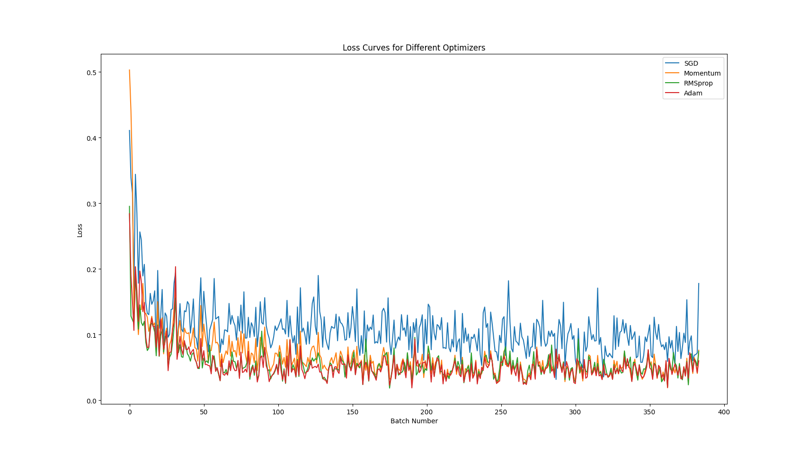

    

### [Regression](regression.py)

### [Classification](classification.py)

### [Optimizer](optimizer.py)

### [CNN](CNN.py)

### [RNN (Demo)](RNN_demo.py)

### [RNN (Regression)](RNN_Regression.py)

### [Autoencoder](autoencoder.py)

### [GAN (Generative Adversarial Nets)](GAN.py)

### [Dropout](dropout.py)

### [Batch Normalization](Batch_Normalization.py)
#### [Batch Normalization RELU](Batch_Normalization.py)

#### [Batch Normalization TANH](Batch_Normalization.py)

